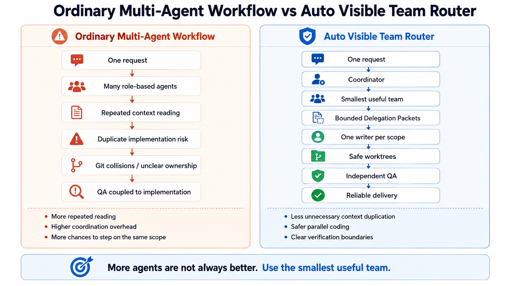
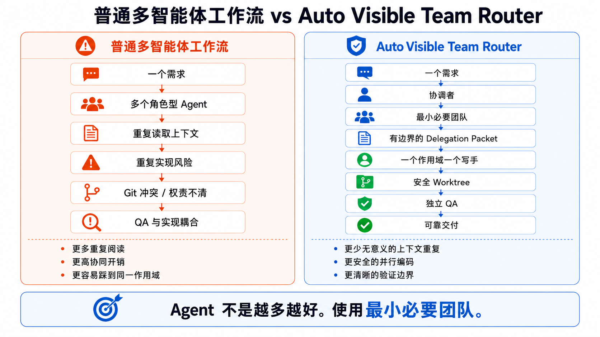
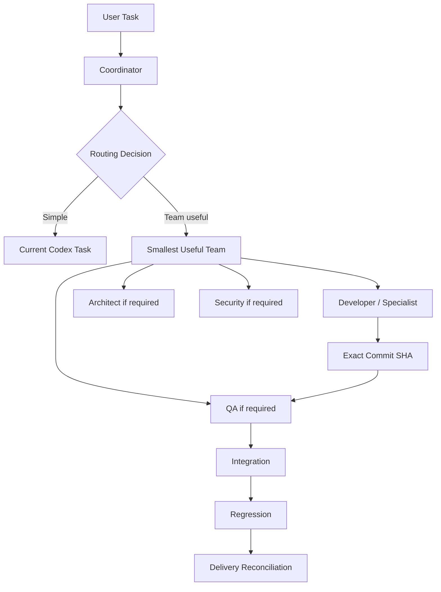

# Auto Visible Team Router

A context-efficient multi-agent routing Skill for Codex that coordinates
user-visible specialist tasks, bounded context delegation, Git worktrees,
independent QA, and reliable delivery.

- **Current release:** V1.3.3
- **Status:** Stable current generation
- **Future work:** Workstream-oriented V2 research (experimental, not included
  in this release)

## What is this?

**A multi-agent visible-task router for Codex.**

It decides when a coding task should stay in one Codex task and when it actually
benefits from a small team of user-visible specialist tasks. It is a Codex Skill
with routing policy and PowerShell support tools, not a background orchestration
service.

## Why does it exist?

Multi-agent coding can easily become wasteful and chaotic:

- multiple agents reread the same repository;
- agents repeatedly reconstruct the same project context;
- several agents implement overlapping functionality;
- parallel writers collide in Git;
- QA can become coupled to implementation;
- long-running agent teams accumulate coordination overhead.

Auto Visible Team Router is designed to reduce unnecessary context duplication
while keeping Git ownership, independent verification, and delivery boundaries
explicit.

## What makes it different?

**Visible tasks + bounded context + worktree safety + independent QA.**

The router focuses on:

- the smallest useful team;
- user-visible Codex specialist tasks;
- bounded Delegation Packets;
- progressive Read Scopes;
- Context Deltas instead of replaying full history;
- one active writer per scope;
- controlled Git worktree parallelism;
- exact-SHA QA;
- reliable delivery reconciliation.

> More agents are not always better.

## Workflow Comparison



<details>
<summary><strong>中文对比图 / Chinese version</strong></summary>

<br>



</details>

## The Problem

Multi-agent coding is not improved simply by adding more agents.

### Duplicate context

Several agents may independently scan the repository, read the architecture,
review project history, and reconstruct the same state. That repeats work before
any implementation begins.

### Duplicate implementation

When agents do not know which capability is already authoritative, they may
reimplement behavior that already exists instead of extending its current
owner.

### Git collisions

Multiple coding agents can edit the same files, module, or branch. The result
may be merge conflicts, unclear ownership, and difficult integration.

### Verification conflict

When the same agent implements a change and decides whether its own work passes,
independent verification loses value.

### Agent lifecycle complexity

A Codex task (Thread), a Git worktree, and a Git branch are three different
objects. Treating them as one lifecycle can leave dirty worktrees, unknown
branches, duplicate tasks, wrong-SHA verification, or unsafe cleanup decisions.

Auto Visible Team Router does not try to maximize agent count. Its goal is to
**use the smallest useful team**.

## Features

### Smallest Useful Team

Tiny and low-risk work stays in the current Codex task. A specialist is added
only when it contributes distinct implementation, verification, architecture,
research, or security value that justifies the coordination cost.

### User-visible Codex Tasks

Specialists are real user-visible Codex tasks (Threads) that can retain their
role context. A background subagent is not silently substituted for a visible
specialist task.

### Context-Efficient Delegation

The Coordinator acts as the Global Context Owner. It sends one versioned,
bounded Delegation Packet containing the task baseline, scope, direct
dependencies, constraints, acceptance criteria, tests, and existing evidence.

Specialists begin from the smallest useful Read Scope. Later repair cycles use
Context Deltas tied to previous and new exact SHAs instead of replaying the full
conversation and unchanged project history.

### Existing Capability Check

Before medium-or-larger implementation, the router performs one bounded check
for behavior that already exists. It starts from the primary module and direct
dependencies, then reuses that evidence instead of asking every role to repeat
the same repository scan.

### Module-aware Ownership

V1.3.3 separates module responsibility from task identity. Each core module has
a primary owner role, each write scope is explicit, and one active coding writer
per module or overlapping path scope is the default.

Module Registry support defaults to Shadow mode. Persistent Active governance
requires project-specific authorization and exact scheduling-lease evidence.

### Git / Worktree Safety

The router records Thread, Worktree, and Branch identity separately. It creates
a new worktree only when two or more coding agents truly need parallel,
disjoint edits with a material time benefit.

Read-only roles such as Architect, QA, Security, Reviewer, and Research do not
receive a new coding worktree by default.

### Worktree Budget

Each project defaults to a budget of three retained Router-managed or adopted
worktree paths. At the budget, the order is reuse, wait, then serial execution.
Unknown or user-owned worktrees are not deleted to manufacture capacity.

### Exact-SHA QA

QA verifies the exact Developer commit SHA. QA does not modify Developer code
and then pass its own repair. A failure returns to the owning Developer, who
produces a new SHA for QA to verify.

### ReadOnly Guard

Architect, QA, Reviewer, Research, and Security are Policy-Enforced Read Only by
default. `scripts/ReadOnly-Guard.ps1` compares Git state before and after an
assignment and reports either `READ_ONLY_CONFIRMED` or
`READ_ONLY_STATE_CHANGED`.

### Delivery Reliability

V1.3.3 separates work completion from result delivery. A compact Delivery
Receipt is reconciled with the specialist result before Coordinator ACK. A
missing result permits one controlled `REDELIVER` of the existing summary; it
does not rerun the work, tests, build, network access, or Provider calls.

This is **Skill-layer reliability**. Codex does not currently expose an
app-owned atomic Receipt/ACK transaction, and this project does not claim
platform-level exactly-once delivery.

### Safe Git Cleanup

Cleanup is eligible only when Router ownership, clean state, final SHA, exact-SHA
QA, and integration containment or durable retention are all proven. Unknown,
adopted, user-owned, protected, dirty, or unmerged Git objects are never
auto-deleted.

## Architecture



Roles are selected from evidence. The diagram shows possible gates, not a fixed
team for every task.

## Context Efficiency

The Coordinator is the Global Context Owner for the current routing decision:

```text
Coordinator
    |
    v
Bounded Delegation Packet
    |
    v
Specialist at Scope 1 + assigned evidence
```

Developer and QA normally begin at Scope 1 with assigned files, direct
dependencies, relevant interfaces, exact SHA/diff evidence, and targeted tests.
They do not default to a repository-wide scan.

When evidence is insufficient, the scope widens progressively:

```text
Scope 1 -> Scope 2 -> Scope 3 -> Scope 4
           only when concrete evidence requires it
```

Developer-to-QA repair loops use a Context Delta with the previous SHA, new SHA,
changed files, new findings, and unchanged constraints.

**This project does not promise a fixed token-saving percentage.** Context
efficiency depends on task structure, model behavior, repository size, tool
usage, the number of specialists, and the amount of independent verification.

## Git Safety

**Thread != Worktree != Branch.**

| Object | Meaning |
| --- | --- |
| Thread | A user-visible Codex task with retained conversation and role context. |
| Worktree | A physical isolated checkout that shares the repository's Git metadata. |
| Branch | A Git reference naming a commit history. |

Parallel coding follows this gate:

```text
parallel coding writers
        |
        v
disjoint ownership and paths
        |
        v
separate worktree only when necessary
```

Architect, QA, Security, Reviewer, and Research are read-only roles by default
and do not justify a new coding worktree on their own. Git also permits a named
branch to be checked out in only one worktree at a time.

## Usage Examples

Actual routing depends on task evidence, risk, existing capabilities, and the
available Codex tools. These examples are illustrative, not fixed role recipes.

### Example 1 - Tiny edit

**User:** `Fix this typo.`

**Result:** Current task only. No team, no worktree, and no independent QA unless
the real risk requires it.

### Example 2 - Normal feature

**User:** `Add a settings option and persist it.`

**Possible route:** One Developer performs a bounded capability check, implements
the change, and runs targeted verification. Independent QA is added only if the
risk justifies it.

### Example 3 - Parallel feature

**User:** `Implement an independent backend API and frontend page.`

**Possible route:** Frontend, Backend, and QA, but only when write ownership is
actually disjoint and parallel work has material value. Otherwise the work is
serialized.

### Example 4 - QA failure

```text
Developer SHA A
    |
    v
QA FAIL
    |
    v
Developer repair
    |
    v
Developer SHA B
    |
    v
QA verifies SHA B
```

QA does not repair SHA A and pass itself.

### Example 5 - Security-sensitive change

A credential, permission, or authentication change may route to Developer, QA,
and Security. The additional roles are selected only when their independent
evidence is necessary.

## Installation

V1.3.3 includes a Windows PowerShell management script. Codex loads user-level
Skills from `$HOME/.agents/skills`; see the official OpenAI documentation for
[creating and loading Skills](https://learn.chatgpt.com/docs/build-skills).

### 1. Inspect the downloaded source

Open PowerShell in the repository root, then run:

```powershell
.\scripts\Manage-Global.ps1 -Action Status
```

### 2. Install the user-level Skill

```powershell
$routerSource = (Resolve-Path .).Path
.\scripts\Manage-Global.ps1 -Action Install -SourceRoot $routerSource
```

`Install` creates a recoverable backup, copies the Skill to
`$HOME/.agents/skills/auto-visible-team-router`, and enables one managed block in
`$CODEX_HOME/AGENTS.md`. Existing Thread and Module Registry files are retained.

### 3. Verify status

```powershell
$routerManager = Join-Path $HOME '.agents\skills\auto-visible-team-router\scripts\Manage-Global.ps1'
& $routerManager -Action Status
```

### Management commands

Run lifecycle actions from the installed Skill copy:

```powershell
$routerManager = Join-Path $HOME '.agents\skills\auto-visible-team-router\scripts\Manage-Global.ps1'

& $routerManager -Action Disable
& $routerManager -Action Enable
& $routerManager -Action Uninstall -ConfirmUninstall
```

- `Disable` removes only the managed AGENTS block and retains Skill files and
  both Registries.
- `Enable` restores exactly one current managed block.
- `Uninstall` requires `-ConfirmUninstall`, removes only the exact installed
  Skill directory and managed block, and retains both Registries.

Codex builds its AGENTS instruction chain per task/session. After an install or
policy change, start a new task or restart/reload Codex before relying on the
new instructions.

### Package validation

```powershell
.\scripts\Validate-V1.ps1 -SkillRoot (Resolve-Path .).Path -Mode Package
```

The repository also contains automated behavior tests and a temporary Git
lifecycle test. Automated evidence does not replace real Codex App evidence
when a release claim depends on visible tasks or real project state.

## Repository Structure

```text
auto-visible-team-router/
|-- agents/
|   `-- openai.yaml
|-- references/
|   |-- acceptance-tests.md
|   |-- context-delegation.md
|   |-- delivery-reliability.md
|   |-- migration-integration.md
|   |-- module-governance.md
|   |-- role-catalog.md
|   |-- routing-policy.md
|   |-- thread-lifecycle.md
|   `-- visible-thread-delivery-recovery.md
|-- scripts/
|   |-- Manage-Global.ps1
|   |-- Module-Registry.ps1
|   |-- ReadOnly-Guard.ps1
|   |-- Registry-Lock.ps1
|   |-- Thread-Registry.ps1
|   |-- Run-Acceptance-V1.3.1.ps1
|   |-- Run-Acceptance-V1.3.2.ps1
|   |-- Run-Acceptance-V1.3.3.ps1
|   `-- Validate-V1*.ps1
|-- tests/
|   `-- Test-*.ps1
|-- .gitignore
|-- README.md
|-- SKILL.md
`-- VERSION
```

Runtime Registry files are user state and are deliberately not part of this
source distribution.

## Limitations

1. Codex does not currently expose an app-owned atomic Receipt/ACK transaction.
   Delivery reliability is implemented at the Skill layer.
2. Visible specialist tasks still consume model usage. More agents are not
   automatically cheaper.
3. Context-efficient delegation does not guarantee a specific token-saving
   percentage.
4. Git worktrees isolate filesystem changes but cannot eliminate logical
   integration conflicts.
5. Policy-Enforced Read Only is detection and workflow control, not a hard OS
   sandbox unless the environment itself enforces that boundary.
6. The router does not automatically push, deploy, publish, delete unknown Git
   objects, or change user permissions without authorization.
7. V1.3.3 is role-oriented. Future experimental work may explore more
   task/workstream-oriented routing.

For Codex worktree behavior and lifecycle details, see the official OpenAI
[Git worktrees documentation](https://learn.chatgpt.com/docs/environments/git-worktrees).

## Roadmap

### Experimental

- workstream-oriented routing;
- task-scoped agent lifecycles;
- dependency-aware parallelism;
- lower coordination overhead.

These are future research directions. They are not implemented V1.3.3
capabilities, and no V2 source is included in this release.

## Philosophy

> More agents are not always better.

The goal of Auto Visible Team Router is not to maximize parallelism. It is to
use the smallest team that materially improves correctness, independence,
delivery, or wall-clock time.

## License

Auto Visible Team Router is available under the [MIT License](LICENSE).

Copyright (c) 2026 JasonYang-GJ

## Status

- **Current release:** V1.3.3
- **Status:** Stable current generation
- **Future work:** Workstream-oriented V2 research
